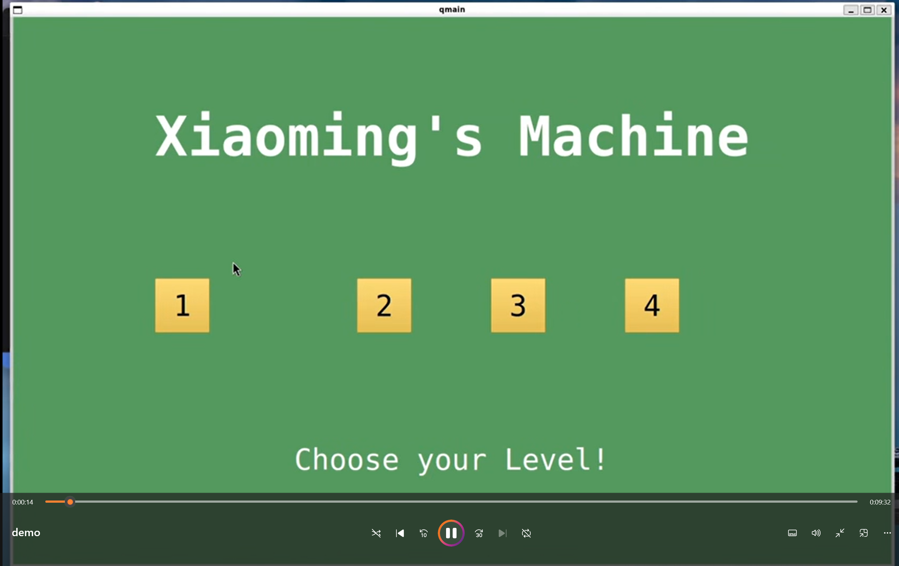

# MOCK_human_resources
This is a project trying to mock the game "human resources" using gui, which is qmain of cpp

# Details of the Game
There are four levels in total, each one is harder than previous one. 
After entering the level, you first need to read the instruction which will be shown on the top of the screen. 
Then, drag the function blocks to the designed section, and run. Try to satisfy the instruction using less function blocks!

# Requirement
g++ 13.3.0
QMake version 3.1
(Using Qt version 5.15.13 in /usr/lib/x86_64-linux-gnu)

# Photo

